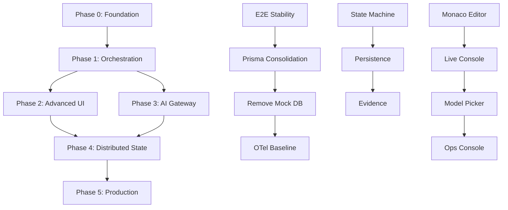

# AI App Platform - Complete Development Roadmap

## Vision

Transform this repository from a basic Next.js project management app into a fully autonomous AI coding system capable of end-to-end software development tasks. The system will implement the complete specification in `docs/spec.md`, providing a production-ready platform with Planner → Coder → Critique orchestration, advanced UI features, multi-model AI integration, and comprehensive observability.

## Current State Summary

### ✅ Foundation Assets (Working)

- **Monorepo Structure**: Apps (web), packages (gateway, jobs, db), tests (unit, E2E)
- **Technology Stack**: Next.js 14, TypeScript, Prisma, PostgreSQL, Redis, Docker
- **Authentication**: NextAuth with credential provider, demo user (`demo@example.com`)
- **Database**: PostgreSQL with Prisma migrations, User and Project models
- **AI Gateway**: Basic LiteLLM integration with mock mode for testing
- **Job Queue**: BullMQ with Redis backend, sample job processing
- **Testing**: Jest unit tests (20 passing), Playwright E2E framework
- **CI/CD**: GitHub Actions with lint, type-check, unit tests, E2E, SBOM generation
- **Development Environment**: Docker compose with DB/Redis, npm workspaces

### ⚠️ Known Issues (Production Readiness Plan)

- Playwright E2E tests occasionally flaky (modal closing timing)
- Prisma schema duplication between `apps/web/prisma` and `packages/db/prisma`
- Postgres version mismatch (CI: 16, compose: 15-alpine)
- In-memory mock DB file `apps/web/src/lib/db.ts` still present
- Missing OTel observability traces

## Delta vs Spec Requirements

| Spec Component             | Current State         | Gap Analysis                                          |
| -------------------------- | --------------------- | ----------------------------------------------------- |
| **Orchestration System**   | None                  | Missing complete Planner→Coder→Critique state machine |
| **Advanced UI**            | Basic project list    | Missing Monaco editor, live console, model picker     |
| **Multi-model AI**         | LiteLLM (OpenAI only) | Missing Anthropic/Gemini adapters, failover logic     |
| **Real-time Features**     | None                  | Missing WebSocket streaming, progress tracking        |
| **Distributed State**      | Redis jobs only       | Missing event sourcing, state versioning              |
| **Code Execution**         | None                  | Missing sandboxed Docker execution environment        |
| **Testing Infrastructure** | Basic Jest/Playwright | Missing automated test generation                     |
| **Monitoring**             | Health endpoint       | Missing OTel traces, metrics dashboard                |
| **Configuration**          | Static env vars       | Missing dynamic config, feature flags                 |

## Phases & Sub-phases

### Phase 0: Finalize Foundation (3-5 days) 🛠️

**Goal**: All unit+E2E tests green; stable DB/seed/migrations; aligned Postgres versions; OTel baseline.

#### 0.1 Fix E2E Test Stability

- **Files**: `tests/e2e/tests/projects.spec.ts`, `apps/web/src/app/projects/ProjectsClient.tsx`
- **Tasks**: Fix modal closing timing, replace network waits with UI state assertions
- **Tests**: All Playwright tests pass reliably across Chromium/Firefox/WebKit
- **DoD**: Reproducible green E2E on CI with HTML report + trace attached

#### 0.2 Prisma Source of Truth Consolidation

- **Files**: `Dockerfile`, `apps/web/prisma/`, `packages/db/prisma/` (remove), CI scripts
- **Tasks**: Use `apps/web/prisma` as single source, update Dockerfile, remove duplicates
- **Tests**: CI migration/generate/seed works; Docker build succeeds
- **DoD**: One schema location; CI and Docker builds work without `packages/db/prisma`

#### 0.3 Remove Legacy Mock DB

- **Files**: `apps/web/src/lib/db.ts` (delete), audit imports
- **Tasks**: Search/replace mock DB imports with real Prisma client
- **Tests**: No runtime imports of in-memory DB; all tests use real Prisma
- **DoD**: No mock imports; seed upsert pattern; "happy-path login" E2E added

#### 0.4 Observability Baseline

- **Files**: `packages/observability/` (new), `apps/web/src/lib/otel.ts` (new)
- **Tasks**: Wire OTel SDK, trace IDs in server logs, PR summary correlation
- **Tests**: Request→trace correlation test; trace IDs in API responses
- **DoD**: Trace correlation shown in `docs/observability.md`

### Phase 1: Core Orchestration (2-3 weeks) 🤖

**Goal**: Introduce orchestrator package with Planner → Coder → Critique state machine.

#### 1.1 Orchestrator State Machine

- **Files**: `packages/orchestrator/` (new), `apps/web/src/app/api/orchestrator/` (new)
- **Tasks**: Create state machine, job persistence, REST/WebSocket endpoints
- **Components**: Planner (NL→steps), Coder (call gateway), Critique (ESLint/tests)
- **Tests**: Unit tests for each component; integration test for full pipeline
- **DoD**: `/orchestrator/jobs`, `/orchestrator/logs` endpoints; E2E calls trivial job

#### 1.2 Job Persistence & Resume

- **Files**: `packages/orchestrator/src/state.ts`, Redis schema updates
- **Tasks**: Store job state in Redis, idempotent resume, cancellation support
- **Tests**: Kill/restart scenario test; job resumes without data loss
- **DoD**: Orchestrator jobs survive service restarts

#### 1.3 Evidence & Coverage

- **Files**: PR templates, trace correlation
- **Tasks**: Link orchestrator job traces from PR; achieve 80%+ coverage
- **Tests**: Coverage reports, trace ID linking tests
- **DoD**: OTel traces linked in PR summary; ≥80% orchestrator package coverage

### Phase 2: Advanced UI (2-3 weeks) 🖥️

**Goal**: Enable users to drive orchestrator with live progress and Monaco editor.

#### 2.1 Monaco Code Editor

- **Files**: `apps/web/src/components/editor/` (new), `/projects/[id]` page updates
- **Tasks**: Monaco integration, multi-file tabs, auto-save, ESLint diagnostics
- **Tests**: Playwright specs for editor open/save, syntax highlighting
- **DoD**: Full-featured code editor with linting in project detail view

#### 2.2 Live Streaming Console

- **Files**: `apps/web/src/hooks/useWebSocket.ts` (new), `ProjectsClient.tsx` updates
- **Tasks**: WebSocket client hook, stream orchestrator logs/status real-time
- **Tests**: WebSocket connection tests, log rendering tests
- **DoD**: Live log streaming with component status indicators

#### 2.3 Model Picker & Metrics

- **Files**: `apps/web/src/components/ModelPicker.tsx` (new), gateway metrics API
- **Tasks**: Dropdown backed by gateway, cost & p95 latency display
- **Tests**: Model selection tests, metrics fetching tests
- **DoD**: Dynamic model selection with performance metrics

#### 2.4 Operations Console

- **Files**: `apps/web/src/components/OpsConsole.tsx` (new)
- **Tasks**: Progress bars, component status, export logs functionality
- **Tests**: Progress tracking tests, log export tests
- **DoD**: Complete ops dashboard with progress visualization

### Phase 3: AI Gateway Enhancement (2 weeks) 🧠

**Goal**: Multi-model support, failover, observability for AI providers.

#### 3.1 Multi-Provider Adapters

- **Files**: `packages/gateway/src/providers/` (new), adapter interfaces
- **Tasks**: Implement Claude, Gemini adapters; selection strategy
- **Tests**: Unit tests per adapter; integration tests with mock providers
- **DoD**: All major AI providers supported with consistent interface

#### 3.2 Failover & Circuit Breaker

- **Files**: `packages/gateway/src/failover.ts` (new), retry policies
- **Tasks**: Retry + fallback policy, circuit breaker, configurable routes
- **Tests**: Simulated provider outage scenario tests
- **DoD**: Automatic failover working; circuit breaker prevents cascading failures

#### 3.3 Full Observability

- **Files**: `packages/gateway/src/metrics.ts` (new), Langfuse integration
- **Tasks**: Cost/latency tracking, `/metrics`, `/health` endpoints
- **Tests**: Metrics collection tests, Langfuse trace tests
- **DoD**: Complete metrics dashboard; Langfuse integration documented

### Phase 4: Distributed State & Events (2-3 weeks) ⚡

**Goal**: Scale orchestration with event sourcing and richer contracts.

#### 4.1 Message Queue Integration

- **Files**: `packages/events/` (new), RabbitMQ/Kafka setup
- **Tasks**: Event-driven architecture, dead-letter handling
- **Tests**: Event publishing/consuming tests, DLQ tests
- **DoD**: Reliable event processing with DLQ replay capability

#### 4.2 Event Sourcing & GraphQL

- **Files**: `packages/orchestrator/src/events.ts`, GraphQL subscriptions (optional)
- **Tasks**: Event-sourced job log with replay, GraphQL subscriptions
- **Tests**: Event replay tests, subscription tests
- **DoD**: Complete audit trail with replay capability

#### 4.3 Service Contracts

- **Files**: gRPC definitions, JSON Schema validation
- **Tasks**: gRPC internal calls, JSON Schema envelope validation
- **Tests**: Contract validation tests, gRPC communication tests
- **DoD**: Soak test @100 concurrent jobs; contracts checked in

### Phase 5: Production & Compliance (1-2 weeks) 🚀

**Goal**: Production readiness with compliance documentation.

#### 5.1 Security & Supply Chain

- **Files**: `docs/compliance/` (new), ASVS evidence, SBOM enhancements
- **Tasks**: ASVS v5.0 mapping, SBOM (CycloneDX 1.6), SLSA v1.0 provenance
- **Tests**: Security scanning tests, supply chain verification
- **DoD**: Complete security evidence bundle

#### 5.2 Regulatory Compliance

- **Files**: `docs/compliance/ai-act/`, `docs/compliance/iso42001/`
- **Tasks**: EU AI Act GPAI transparency docs, ISO/IEC 42001 alignment
- **Tests**: Compliance verification tests
- **DoD**: Regulatory compliance documentation complete

#### 5.3 Deployment & Operations

- **Files**: `docs/runbooks/`, canary deployment scripts
- **Tasks**: Canary rollout playbook, rollback drills, on-call runbook
- **Tests**: Canary deployment tests, rollback scenario tests
- **DoD**: Successful canary 10→30→60→100 with SLO gates

## Dependencies

## Risks & Mitigations

| Risk                         | Impact | Probability | Mitigation                                                     |
| ---------------------------- | ------ | ----------- | -------------------------------------------------------------- |
| **E2E Test Flakiness**       | High   | Medium      | Use UI state assertions, avoid network waits, stable selectors |
| **Prisma Migration Issues**  | Medium | Low         | Stage changes, run full CI locally, fail fast on ENV errors    |
| **WebSocket Scaling**        | Medium | Medium      | Use Socket.io with Redis adapter, load balancing               |
| **AI Provider Rate Limits**  | High   | High        | Implement backoff, circuit breakers, multiple providers        |
| **State Machine Complexity** | High   | Medium      | Start simple, extensive unit tests, state visualization        |
| **Performance Degradation**  | Medium | Medium      | Load testing at each phase, performance budgets                |

## Evidence & Definition of Done

Every PR must include:

- **CI Summary**: All checks green (lint, type-check, unit tests, E2E)
- **Coverage Report**: Maintain >80% test coverage for new code
- **SARIF Security Scan**: No high/critical vulnerabilities
- **Artifact Links**: Playwright reports, trace links, build artifacts
- **Supply Chain**: Updated SBOM (CycloneDX), SLSA provenance
- **Documentation**: Updated README, API docs, runbooks as needed

## Release Plan & Timeline

### Gates (G0 → G8)

| Gate   | Milestone           | Timeline | Success Criteria                                  |
| ------ | ------------------- | -------- | ------------------------------------------------- |
| **G0** | Foundation Ready    | Week 1   | All tests green, stable E2E, single Prisma source |
| **G1** | Basic Orchestration | Week 3   | Planner→Coder→Critique pipeline working           |
| **G2** | Advanced UI         | Week 5   | Monaco editor, live console, model picker         |
| **G3** | Multi-Model Gateway | Week 7   | Claude/Gemini support, failover working           |
| **G4** | Distributed State   | Week 9   | Event sourcing, 100 concurrent jobs               |
| **G5** | Security Complete   | Week 10  | ASVS mapping, SBOM/SLSA compliance                |
| **G6** | Compliance Ready    | Week 11  | EU AI Act, ISO 42001 documentation                |
| **G7** | Production Deploy   | Week 12  | Canary rollout successful                         |
| **G8** | Full Release        | Week 12  | All spec requirements implemented                 |

### Issue Mapping

| Spec Section                    | GitHub Issues     | Dependencies        |
| ------------------------------- | ----------------- | ------------------- |
| **2. Autonomous Orchestration** | #1-#3 (Phase 1)   | Phase 0 complete    |
| **1. Comprehensive UI**         | #4-#7 (Phase 2)   | Phase 1.1 complete  |
| **4. AI Model Management**      | #8-#10 (Phase 3)  | Phase 1.1 complete  |
| **3. Distributed State**        | #11-#13 (Phase 4) | Phase 2, 3 complete |
| **5. Production Readiness**     | #14-#16 (Phase 5) | All phases complete |

---

**Next Action**: Begin Phase 0.1 - Fix E2E test stability issues to establish solid foundation.
